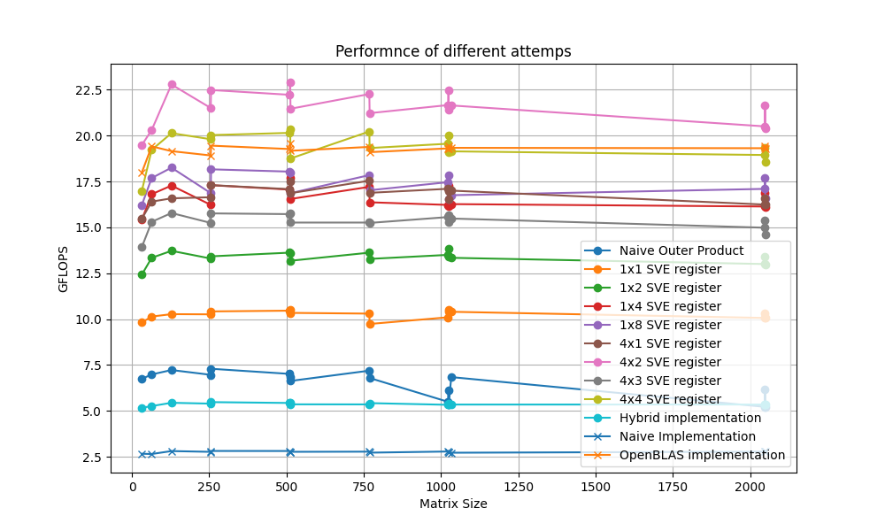
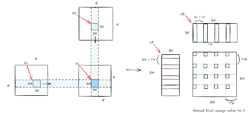
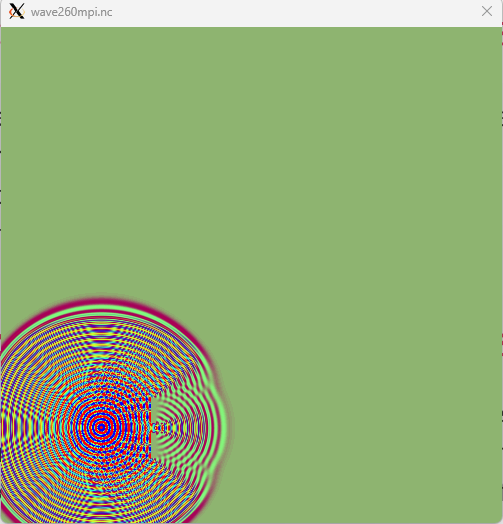
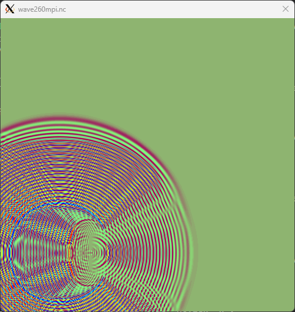



## Overview

CSE260 delves into the principles and practices of **High-Performance Computing (HPC)**, emphasizing parallel programming paradigms to solve computationally intensive problems efficiently.

**Key Topics Covered**:

- **CPU Vectorization**: Leveraging vector extensions for parallel computation on CPUs.
- **CUDA Programming**: Utilizing GPU architectures for accelerated computation.
- **MPI (Message Passing Interface)**: Implementing distributed memory parallelism.

Thanks to Prof. Chin, I learned a lot from this course by praticing in the projects and analising the reasons behind the experiments' results

---

## Project 1: Optimizing Matrix Multiplication with CPU Vectorization

In this project, we optimized matrix multiplication by leveraging CPU vector extensions such as Intel's AVX and ARM's SVE to enhance computational throughput.

**Techniques Employed**:

- **Cache Blocking**: Divided matrices into smaller blocks to fit into the CPU cache, reducing memory access latency.
- **Vector Intrinsics**: Utilized vectorized instructions to perform multiple operations per cycle, enhancing performance.
- **Memory Alignment**: Ensured data structures were aligned in memory to prevent performance penalties due to misalignment.

**Outcomes**:

- Achieved significant performance improvements, with computation speeds exceeding 20 GFLOPS on ARM Neoverse V1 architecture.

---

## Project 2: Accelerating Matrix Multiplication with CUDA

This project focused on implementing matrix multiplication on NVIDIA GPUs using CUDA to exploit massive parallelism and achieve high computational throughput.

**Approach**:

- **Tiling and Shared Memory**: Implemented tiling strategies to load matrix sub-blocks into shared memory, minimizing global memory access.
- **Thread Synchronization**: Managed synchronization among threads to ensure correct data handling during computation.
- **Loop Unrolling**: Applied loop unrolling techniques to reduce loop overhead and increase instruction-level parallelism.

**Results**:

- Achieved performance exceeding 4 TFLOPS on NVIDIA T4 GPUs, demonstrating the effectiveness of GPU acceleration for matrix computations.

*CUDA Performance Graph Placeholder* <!-- Include a graph comparing CUDA performance metrics -->

---

## Project 3: Distributed Wave Simulation with MPI
<!--  -->

  
  
  

In this project, we developed a wave propagation simulation using MPI to distribute computations across multiple processors, enhancing scalability and performance.

**Methodology**:

- **Domain Decomposition**: Partitioned the simulation domain among processors to balance computational load.
- **Non-blocking Communication**: Employed MPI's non-blocking communication routines to overlap computation with data exchange, reducing idle times.
- **Boundary Management**: Implemented ghost cell exchanges to handle boundary conditions between adjacent partitions.

**Achievements**:

- Maintained strong scaling efficiency above 95% up to 16 cores, indicating effective parallelization.
- Demonstrated minimal communication overhead in weak scaling tests, showcasing good scalability for larger problem sizes.

*MPI Scaling Graph Placeholder* <!-- Include a graph illustrating MPI scaling efficiency -->

---

## Reflections and Future Work

**Key Learnings**:

- Effective utilization of parallel programming paradigms can lead to significant performance enhancements in computational applications.
- Understanding hardware architectures is crucial for optimizing software performance, particularly in HPC contexts.

**Future Directions**:

- Explore advanced optimization techniques such as asynchronous computations and dynamic load balancing.
- Investigate the integration of multiple parallel programming models to leverage the strengths of each.

---

## License

Copyright 2016-present [George Cushen](https://georgecushen.com).

Released under the [MIT](https://github.com/HugoBlox/hugo-blox-builder/blob/main/LICENSE.md) license.
