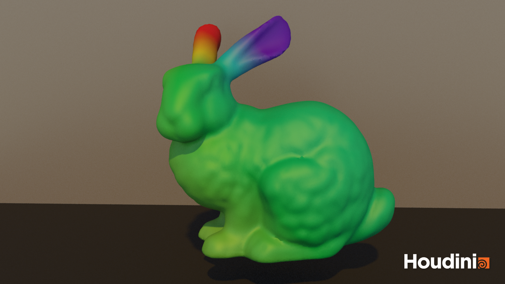
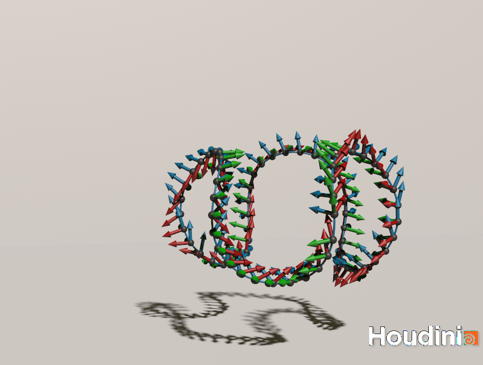
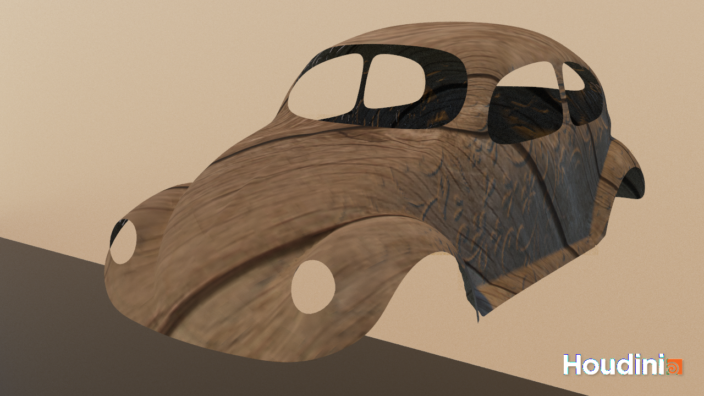
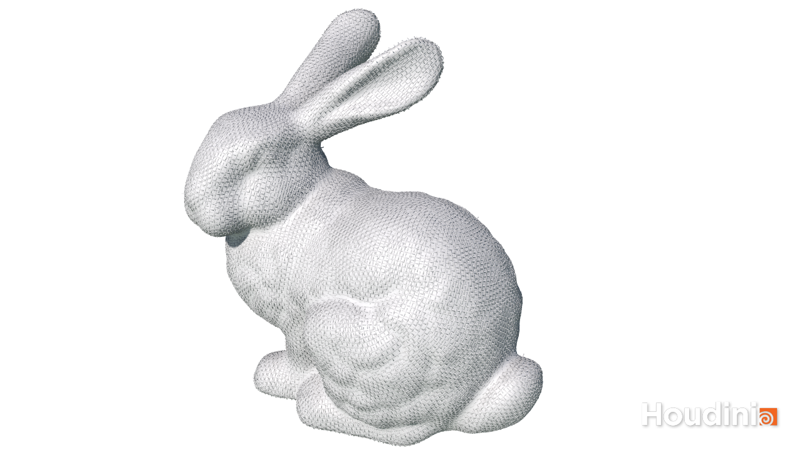


## Overview

This course introduces the mathematical principles of geometry, emphasizing coordinate-free representations and the relationships between geometric entities. Prof. Albert Chern offers a comprehensive introduction to Exterior Algebra, Discrete Laplacian, Curves and Surfaces, Hodge Decomposition, Conformal Flattening, and Vector Field Design. Below are my course works, all implemented in Houdini.

---

## 1. Discrete Laplacian

The **Discrete Laplacian** bridges continuous mathematical concepts with their discrete counterparts on 3D meshes. The course work explores the construction of the Discrete Laplacian on the Bunny.obj mesh.

### Understanding the Discrete Laplacian

The Discrete Laplacian captures both the mesh's connectivity and geometric properties through a combination of:
- Cotangent weights for local geometry
- Discrete exterior derivatives for topology
- Hodge star operators for metric information

### Key Components

1. **Cotangent Weights:**
   - For vertices $v_i$ and $v_j$ connected by an edge:
     \[
     w_{ij} = \frac{1}{2} (\cot \alpha + \cot \beta)
     \]
   where $\alpha$ and $\beta$ are opposite angles to the edge

2. **Discrete Exterior Derivative ($d_0$):**
   - Maps vertex functions to edge functions
   - For an edge $e$ connecting vertices $v_i$ and $v_j$:
     \[
     (d₀ f)_e = f(v_j) - f(v_i)
     \]

3. **Hodge Star Operators:**
   - $star_0$: Operates on vertices, using local area weights
   - $star_1$: Operates on edges, using cotangent weights

### Matrix Construction

The Laplacian matrix combines these operators:
\[
L = d₀^T \star_1 d₀
\]

### Eigenvalue Analysis

The eigenvalue problem reveals geometric features:
\[
L \mathbf{f} = \lambda \star_0 \mathbf{f}
\]

- Low eigenvalues: Global, smooth variations
- High eigenvalues: Local, oscillatory patterns
- Eigenfunctions: Geometric modes of the mesh

### Result

---

## 2. Parallel Frames on Space Curves

The second course work explores **parallel frames** on discrete space curves, which provide a robust way to define coordinate systems along curves in 3D space.

### Understanding Parallel Frames

Parallel frames offer advantages over traditional Frenet frames by providing smooth transitions and avoiding discontinuities at inflection points.

### Key Components

1. **Discrete Space Curve:**
   - A sequence of points $\gamma_0, \gamma_1, ..., \gamma_{n-1}$ in 3D space
   - Connected by edges forming the curve

2. **Tangent Vectors:**
   - For each edge $(i, i+1)$:
     \[
     T_{i,i+1} = \frac{\gamma_{i+1} - \gamma_i}{|\gamma_{i+1} - \gamma_i|}
     \]

3. **Frame Definition:**
   - Tangent vector $T_{i-1,i}$
   - Normal vector $U_{i-1,i}$ perpendicular to tangent
   - Parallel transport ensures minimal twisting

### Implementation Principles

1. **Frame Transport:**
   - Between edges: Rotate frame about $T_{i-1,i} \times T_{i,i+1}$
   - Maintains smoothness while minimizing twist

2. **Geometric Properties:**
   - Preserves parallel nature of frames
   - Minimizes total rotation along curve
   - Adapts to curve geometry naturally

### Result

## 3. Conformal Mapping

Conformal mapping ensures that texture coordinates applied to a 3D surface preserve angles and local shapes, minimizing distortion. This property is critical for applications like texture mapping, geometric analysis, and visual effects.

#### **Key Concepts**
1. **Conformal Energy:**
   - The conformal energy measures how close a map is to being conformal. It is defined as:
     \[
     C[z] = \frac{1}{2}\|dz\|^2 - \text{Area}[z]
     \]
     where \(\|dz\|\) represents the Dirichlet energy, and \(\text{Area}[z]\) captures the total area of the mapped surface.

2. **Rayleigh Quotient:**
   - The conformal map is obtained by minimizing the Rayleigh quotient:
     \[
     \min_z \frac{z^H C z}{z^H \star_0 z}
     \]
     This leads to solving the eigenvalue problem:
     \[
     C z = \lambda \star_0 z
     \]

#### **Implementation in Houdini**
1. **Laplacian and Area Matrices:**
   The Laplacian matrix (\(L\)) and area matrix (\(A\)) were precomputed using sparse matrix operations. The combined conformal matrix (\(C\)) was derived as:
     \[
     C = \frac{1}{2} L - A
     \]
     They are same as what we did in section 1.

2. **Eigenvalue Solver:**
   Using a spectral solver, the smallest nonzero eigenvalue and its corresponding eigenvector were computed. This eigenvector defines the conformal map.

3. **Texture Coordinates:**
   The real and imaginary parts of the solution were assigned as \(u\) and \(v\) attributes to the mesh points. These attributes define the conformal texture map.

4. **Visualization:**
   Houdini's texture shaders and displacement shader were used to preview the conformal map and apply textures without distortion.

#### **Result**

## 4. Vector Field Design: Cross Fields on Surfaces

The final coursework explores the design of **cross fields** on 3D surfaces, such as the Bunny mesh, using a connection Laplacian approach. Cross fields are essential in applications like quadrilateral remeshing and direction field design.

---

#### **Key Concepts**
1. **Cross Fields:**
   - A cross field is a quarter-turn symmetric vector field, meaning it returns to its original state after a \( \pi/2 \) rotation.
   - The field's orientation at each point is encoded as a phase angle, \(@phase\), derived from a complex-valued eigenfunction.

2. **Connection Laplacian:**
   - To ensure smooth transitions between cross fields at neighboring points, the connection Laplacian incorporates angular offsets \(\alpha_{ij}\), which account for misalignment of reference directions at adjacent points.

---

#### **Implementation**
1. **Connection Weights:**
   - Compute the **Levi-Civita connection** \(\alpha_{ij}^{LC}\), which defines angular relationships between half-edges.
   - Scale the Levi-Civita connection by a factor of 4 to adjust for the quarter-turn symmetry of the cross field.

2. **Covariant Derivative:**
   - Define the derivative \((d_{\nabla}\psi)_{ij} = e^{-i\alpha_{ij}}\psi_j - \psi_i\), where \(\psi\) is the complex-valued function encoding the cross field.

3. **Minimizing Energy:**
   - Solve the smallest eigenvalue problem of the connection Laplacian:
     \[
     L\psi = \lambda \star_0 \psi
     \]
     where \(L\) is constructed from the covariant derivative, and \(\star_0, \star_1\) are area and cotangent weight matrices.

4. **Visualization:**
   - Extract the phase angle, \(@phase = \text{atan2}(\text{Im}(\psi), \text{Re}(\psi))\), and visualize the cross field as a rotation from the reference half-edge.

---

#### **Result**
The smoothest cross field was generated by solving the eigenvalue problem, and singularities were identified and visualized as critical points on the Bunny mesh. This showcases the elegance of geometric processing for practical applications like remeshing and surface parameterization.

## License

Copyright 2016-present [George Cushen](https://georgecushen.com).

Released under the [MIT](https://github.com/HugoBlox/hugo-blox-builder/blob/main/LICENSE.md) license.
