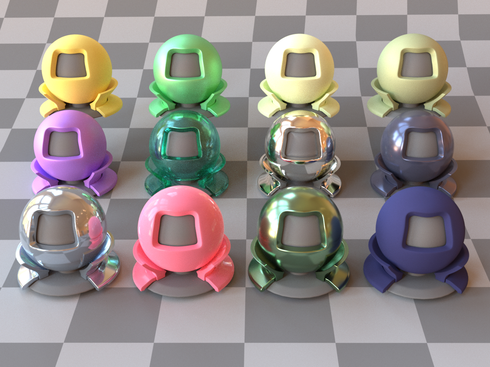
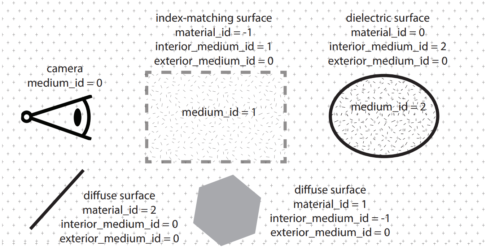
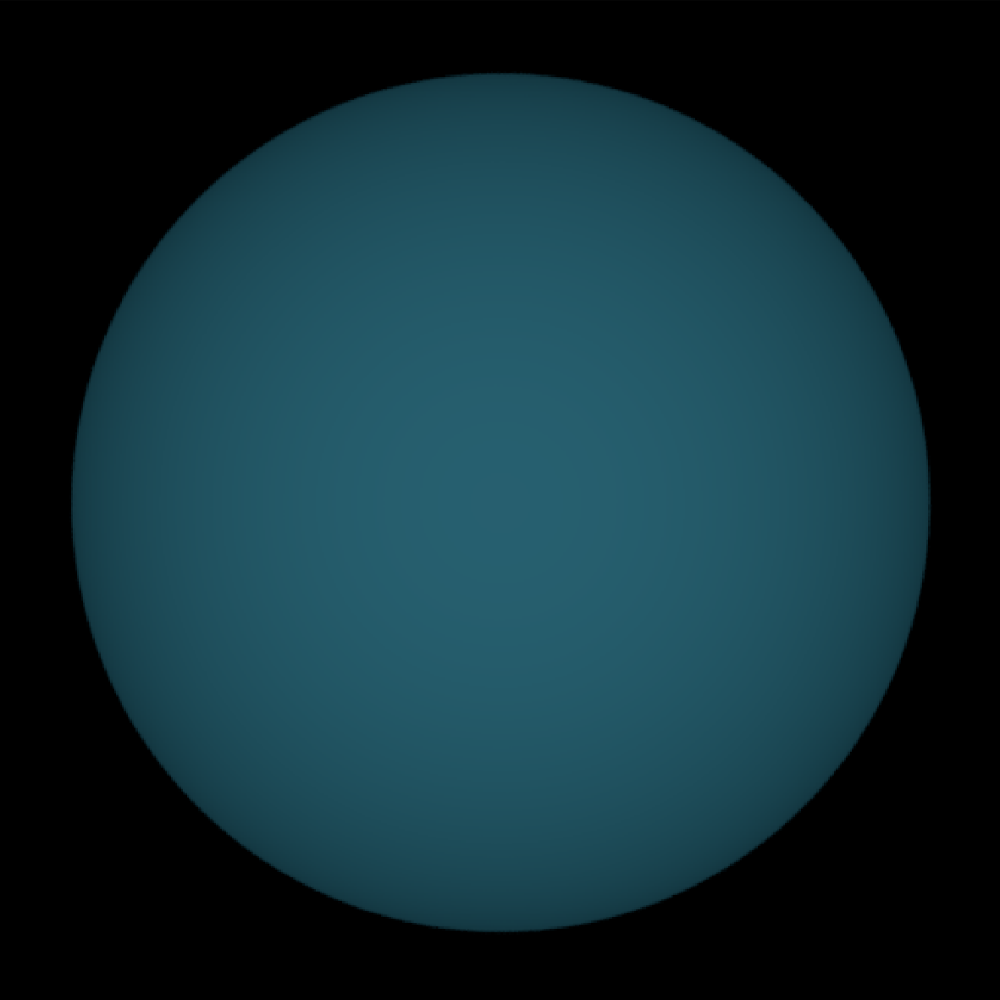
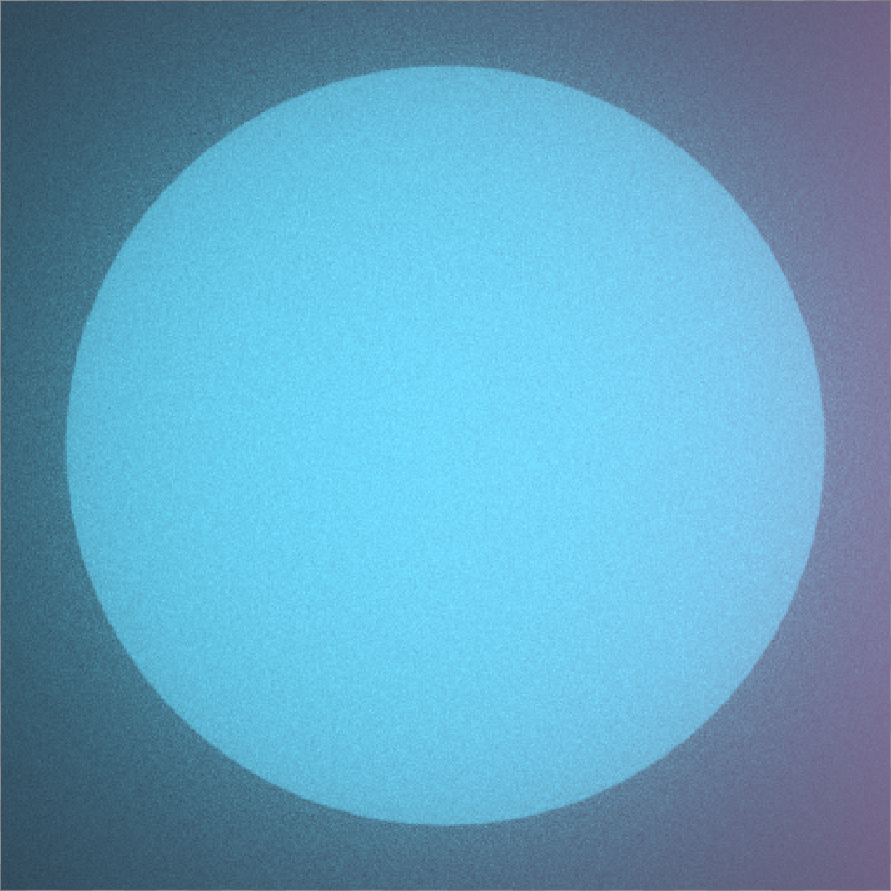
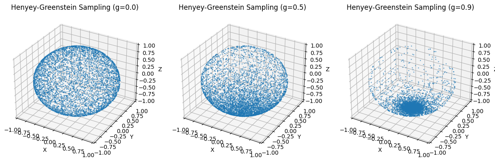
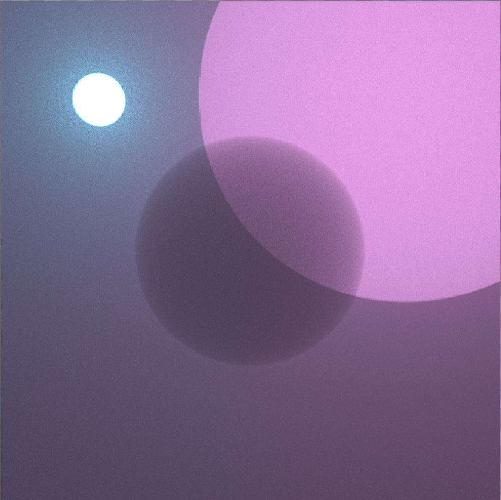
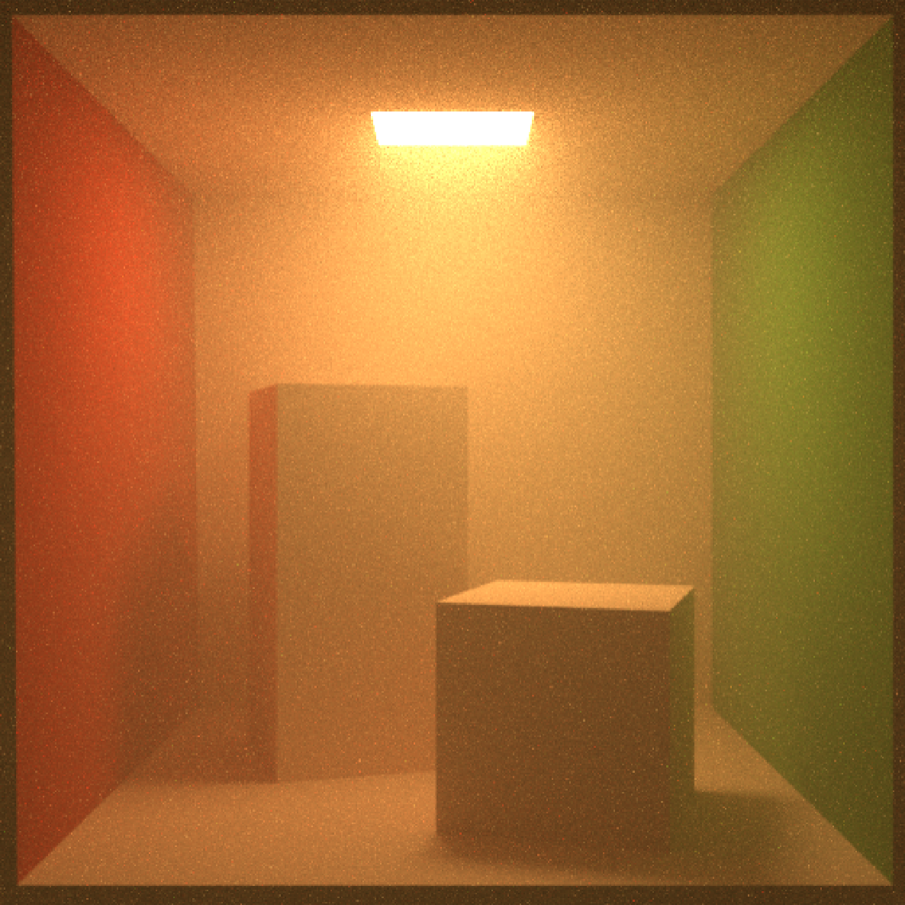



## Disney Principled BSDF

Original handouts: [CSE 272 Homework1]( https://cseweb.ucsd.edu/~tzli/cse272/wi2025/homework1.pdf )

This is a reproduction of a siggraph 2012 talk [Physically-Based Shading at Disney](https://media.disneyanimation.com/uploads/production/publication_asset/48/asset/s2012_pbs_disney_brdf_notes_v3.pdf). This shading model also implemented in Blender. And the lajolla renderer is capable of rendering scenes exported from Blender that have principled material.

The shading model contains 5 lobes, diffuse, metal, glass, clearcoat and sheen and we sample the lobes based on the principled parameters to make it efficient. For more details, please refer to the handout.

## Volumetric Rendering

Implemented a Volume Renderer in lajolla. 

The following things are simply same as the handout2's pdf. I write them just for myself for a quicker and better review. (So in the future I can quickly unsderstand what I've done. :> )

### Volume Rendering Equation

The whole volume rendering equation is the following equation:
$$
\frac{d}{dt}L(\mathbb{p}(t)), \omega) = -(\sigma_a\ p(t) + \sigma_s\ p(t) )L(p(t), \omega) + L_e(p(t), \omega) + \sigma_s\ p(t) \int_{S_2}\rho(p(t), \omega, \omega' )L(p(t), \omega')d\omega' $$

Here $L$ is luminance, $p$ is distance function, $\sigma_\alpha$ is absorption coefficient, $\sigma_s$ is the scattering coefficient. And $\rho$ is the phase function that is like the BSDFs of surface rendering.

It is scary to understand it at first glance. But there are lot of things we can negelect.

### Break down

The euqation can be break down to 4 parts abosroption, emission, in-scattering and out-scattering.

We can first only consider the absorption part:

$$
\frac{d}{dt}L_1(\mathbb{p}(t), \omega) = -\sigma_a L_1(p(t), \omega) + L_e(p(t),\omega).
$$

This is simply an ODE $ x' = ax + b $, and it have an analytical solution.

The in-scattering accounts for all lights bounce between the particles along the ray, its just like rendering equation. 

$$
\frac{d}{dt}L_{is}(\mathbb{p}(t)), \omega) = \sigma_s\ p(t) \int_{S_2}\rho(p(t), \omega, \omega' )L(p(t), \omega')d\omega' $$

And the lights also bounce out the ray (lights that is scattered). It is just like the absorption:

$$
\frac{d}{dt}L_{os}(\mathbb{p}(t), \omega) = -\sigma_s L_{os}(p(t)).
$$

So it can also be solved and integrated to the absorption ODE equation.

### Participanting Media Data Structure

Its pretty simple in lajolla of how to get the media information. In each intersection, we record the interior and exterior medium. For the medium, we can get it's sigam_s and sigma_a of position p by some simple search (not using advanced datastructure to accelerate it). Note that we need to handle the ray update carefully at the boundary.

### monochromatic absorption-only homogeneous volume

Nothing special, we solve the absorption part's ode and apply it.

It is simple:
$$
L_1(p(t), \omega) =  e^{-\sigma_a t} * L_e(p(t_{hit}))
$$

    

###  Single monochromatic homogeneous volume with absorption and single-scattering, no surface lighting

Still simple, we firstly change variable to make it from sphere to the scene manifold. Then we can get the following equation, looks scary but just same as we mentioned before with visiblity and analytical absorption part same as we solved before.
$$
L_{scatter1}(\mathbf{p}, \omega) =
\int_{\mathcal{M}} \rho(\mathbf{p}(t), \omega, \omega') L_e(\mathbf{p}', \omega')
\exp(-\sigma_t \|\mathbf{p}(t) - \mathbf{p}'\|) 
\frac{|\omega' \cdot \mathbf{n}_{\mathbf{p}' }|}{\|\mathbf{p}(t) - \mathbf{p}'\|^2}
\operatorname{visible}(\mathbf{p}(t), \mathbf{p}') d\mathbf{p}',
$$

So instead of intergrating over the Sphere, we now change it to integrateing over all points on surface points, so actually, $\frac{|\omega' \cdot \mathbf{n}_{\mathbf{p}' }|}{\|\mathbf{p}(t) - \mathbf{p}'\|^2}$ this part is simply the Jacobian p to the omega as:
$$
\omega' = \frac{p'-p(t)}{||p'-p(t)||} 
$$

So the full rendering euqation is like this:

$$
\frac{d}{dt} L_2(\mathbf{p}(t), \omega) = - \sigma_t L_2(\mathbf{p}(t), \omega) + \sigma_s L_{scatter1}(\mathbf{p}, \omega).
$$

For now, it is no longer an analytical close form with, but we can solve this by simply using Monte Carlo sampling. To do this, we need to make the form of equation more suitable like a rendering euation we have in normal path tracer.

$$
L_2(\mathbf{p}(0), \omega) = \int_{0}^{t_{\text{hit}}} \exp(-\sigma_t t) \sigma_s L_{scatter1}(\mathbf{p}, \omega) \, dt + \exp(-\sigma_t t_{\text{hit}}) L_e(\mathbf{p}(t_{\text{hit}})).
$$

When $t = 0$, the integral of $p(t) $ from 0 to $+\infty$ should be 1. Hence:
  $$C\int_0^t exp(-\sigma_ts)ds = C(-\frac{\exp(-\sigma_t t )}{\sigma_t} + \frac{1}{\sigma_t})$$ should $\rightarrow 1$ when $t \rightarrow +\infty$. 
Thus, $C(\frac{1}{\sigma_t}) = 1$. Then, we can get $C = \sigma_t$. So that $p(t)$ should be $\sigma_t exp(-\sigma_ts)$

Integrating p(t), we can then get the CDF and solve it we can get our sample function.

$$
t = \frac{log(1-u)}{-\sigma_t}
$$

Also, we need to consider if we sample the distance that is larger than t_hit,  by integrating the larger part. (Equation is in hand out, too trival and lazy to type it here.)

By doing this, The result is like following.

    

And the question here asked about the difference of different phase function, I made an simple viusalization:

The phase function is like this:
$$
p(\cos\theta, g) = \frac{1 - g^2}{4\pi (1 + g^2 + 2g\cos\theta)^{3/2}}
$$

The g controls how concentrate the phase function is and controls how many lights pass through the medium. 

***TODO***: *Equiangular Sampling* implementation and math analyze.

### Multiple monochromatic homogeneous volumes with absorption and multiple-scattering using only phase function sampling, no surface lighting

Then we want to make the scattering recursive and change the direction, but we only sample the scattering.

To implement this, we need to:
1. Sample a distance t
2. Evaluate $L_{scatter}$
3. Sample a new direction

And we do it recursively. When implementing, we need to update the medium when the ray hit another index-matching surface.

This now is a fully MC style process in path tracer and we are familiar with it. We also add a russian roulette here to control the max depth.

### Multiple monochromatic homogeneous volumes with absorption and multiple-scattering with both phase function sampling and next event estimation, no surface lighting

BTW, an extremly long name...

now we want to add nee because sampling phase function is very very inefficient. So we want to pick a point on the light and tracing shadow ray (just like we did in path tracer's nee), and get the transmission between them. The process is still easy to understand and simple, if someone is really reading this blog for knowledge, I would recommend to read the handout's pseudo-code and its math.

But how do we MIS the nee is interesting, we need to multiply the contribution of the MIS weight $\frac{p^2_{phase}}{p^2_{phase} + p^2_{nee}}$ (If you dont know this, you can review the [MIS's knowledge](https://cseweb.ucsd.edu/~tzli/cse168/sp2023/lectures/16_multiple_importance_sampling.pdf).)

Here our solution is just same as said in handout, we simply store the cumulated pdf and calculated it at the end.

    

### Multiple monochromatic homogeneous volumes with absorption and multiple-scattering with both phase unction sampling and next event estimation, with surface lighting

Now we add surface lighting to our volume pathtracer, it is still easy to integrate, we just need to everywhere we sample or evaluate, determine it is a BSDF surface or a medium, using nee like what we did in normal path tracer and we got our result. By far, we can get something that is fancy. Like a cornel box with volume

    

### Multiple chromatic heterogeneous volumes with absorption and multiple-scattering with both phase function sampling and next event estimation, with surface lighting

Actually this part is what I want to review it most since when implementing, I simply followed the instructions and didn't get the math behind. So lets do more math!

Let's now focus on the heterogeneous media and see the radiative transfer equation (no volume emission):

$$
\frac{d}{dt} L(\mathbf{p}(t), \omega) = -\sigma_t (\mathbf{p}(t)) L(\mathbf{p}(t), \omega) + \sigma_s (\mathbf{p}(t)) \int_{S^2} \rho(\omega, \omega') L(\mathbf{p}(t), \omega') d\omega',
$$

This is still same as we mentioned before, but is more complete.

We can then integrate the equation like we have done before:

$$
L(\mathbf{p}(t), \omega) = \int_{0}^{t_{\text{hit}}} T(\mathbf{p}(0), \mathbf{p}(t')) \left( \sigma_s (\mathbf{p}(t')) \int_{S^2} \rho(\omega, \omega') L(\mathbf{p}(t'), \omega') d\omega' \right) dt' + T(\mathbf{p}(0), \mathbf{p}(t_{\text{hit}})) L_{\text{surface}} (\mathbf{p}(t_{\text{hit}})),
$$

Where $T$ is:

$$
T(\mathbf{p}(0), \mathbf{p}(t')) = \exp \left( - \int_{0}^{t'} \sigma_t (\mathbf{p}(t'')) dt'' \right).
$$

> This is basicaly same with what we have calculated before. The only problem is that we now need to sample the $t$!

Here, $T$ is the transmittance that we have calculated, When it is homogeneous, we can calculate its closed-form because it is same every where and we can integrate it analyticaly. But now it is heterogenerous, so we can only solve this problem through Monte-Carlo sampling by sampling along the path.

However, solve this is challenging not because of the MC intrgration or the sampling. It is because that an unbaised estimation for $T$ cannot simply infered form an unbaised estimation of the expoential integration here. (That is: $E[exp(X)] != exp(E[x])$).

I want to give a very simple proof:

Consider a random variable $X$ that takes values 0 or 2 with probability 1/2 each, then we have:
$$\mathbb{E}[X] = (1/2)\cdot0 + (1/2)\cdot2 = 1$$
And then $e^{-\mathbb{E}[X]} \;=\; e^{-1} \;\approx\; 0.3679$. Meanwhile, $\mathbb{E}[e^{-X}] \;=\; \tfrac12\,e^{0} + \tfrac12\,e^{-2} \;=\; 0.5677$.

**Homogenized free-flight sampling**. To solve this problem, we need to apply a trick called *homogenization*. So we convert the heterogeneouse medium into a hoomgeneous medium by inserting the *fake* particle in to the medium. Then we have a closed-form solution. 

You might think that: What??? If I plugin the *fake* medium, then after we minus it, we then is still a heterogeneous medium. (At least I thought it at the first glance or see this solution. :<)

Anyway, then our formulation is like the following:

$$\frac{d}{dt}L(\mathbf{p}(t), \omega) = -(\sigma_t(\mathbf{p}(t)) + \sigma_n(\mathbf{p}(t)))L(\mathbf{p}(t), \omega) + \sigma_n(\mathbf{p}(t))L(\mathbf{p}(t), \omega) + \sigma_s(\mathbf{p}(t)) \int_{S^2} \rho(\omega, \omega')L(\mathbf{p}(t), \omega')d\omega'$$

(Might messy to see on website, if someone is really watching this, I really wish you can see Tzumao's handout).

Here, $\sigma_n$ is what we fulfill the medium. All we did is add something and minus something. Now, we want the first part, when $ \sigma_t(\mathbf{p}(t)) + \sigma_n(\mathbf{p}(t))$ can be a constant, so that we will have an analytical solution for the first part.

A common way to choose $ \sigma_t(\mathbf{p}(t)) + \sigma_n(\mathbf{p}(t))$ is the upper bound of $\sigma_t(\mathbf{p}(t)) $ for all t, so that $\sigma_n(\mathbf{p}(t))$ is larger than 0 and the number is easy to get.

We integrate the formula both side again, same as what we did before to get our radiation function:

$$
L(p, \omega) 
= \int_{0}^{t_{\mathrm{hit}}} 
    T_m\bigl(p(0), p(t')\bigr)
    \Bigl(
        \sigma_n\bigl(p(t')\bigr)\,L\bigl(p(t'), \omega\bigr)
        \;+\;
        \sigma_s\bigl(p(t')\bigr)
        \int_{S^2}
            \rho(\omega, \omega')\,L\bigl(p(t'), \omega'\bigr)
        \, d\omega'
    \Bigr)\,
    dt'
\;+\;
T_m\bigl(p(0), p(t_{\mathrm{hit}})\bigr)\,
L_{\mathrm{surface}}\bigl(p(t_{\mathrm{hit}}), \omega\bigr).
$$

Magically, our $T_m$ is now not a $exp(E[x])$! And we can get the result by using MC integral.

Then we can have our process updated handling the *fake* particle hit event. We can introduce the importance sampling here and since the math here is trival, I will simply skip this part.

- [ ] Fulfill this part indetail. 

**Homogenized nee**.

In nee, we also have same problem as mentioned before. Same techinic can be apply! And the result is just same. 

This is the $T$:
$$
T\bigl(p(0), p(t')\bigr)
~=~
\exp\!\Bigl(
  -\!\int_{0}^{t'} \sigma_{t}\bigl(p(t'')\bigr)\,dt''
\Bigr).
$$

Differentiate and replace using majorant:

$$
\frac{d}{dt'}\,T_{p}(t')
~=~
-\,\sigma_{t}\bigl(p(t')\bigr)\,T_{p}(t')
~=~
-\,\sigma_{m}\,T_{p}(t') \;+\; \sigma_{n}\bigl(p(t')\bigr)\,T_{p}(t'),
\quad
T_{p}(0)=1,
$$

To solve, we can do change of variable $\widetilde{T}_{p}(t') \;=\; \exp\bigl(\sigma_{m}\,t'\bigr)\;T_{p}(t')$.

Then
$$
\frac{d}{dt'}\,\widetilde{T}_{p}(t')
~=~
\sigma_{n}\bigl(p(t')\bigr)\,\widetilde{T}_{p}(t'),
\quad
\widetilde{T}_{p}(0) \;=\; 1,
$$

Then, we simply integrate both side back with $C = 1$

\[
T_{p}(t')
~=~
\frac{\widetilde{T}_{p}(t')}{\exp\bigl(\sigma_{m}\,t'\bigr)}
~=~
\exp\bigl(-\sigma_{m}\,t'\bigr)\!
\Bigl(
  1
  \;+\;
  \int_{0}^{t'}
    \sigma_{n}\bigl(p(t'')\bigr)\,
    \exp\!\bigl(\sigma_{m}\,t''\bigr)\,
    \widetilde{T}_{p}(t'')
  \,dt''
\Bigr).
\]

Our final formulation is like this then:

\[
T_{p}(t')
~=~
\exp\bigl(-\sigma_{m}\,t'\bigr)
\;+\;
\int_{0}^{t'}
  \exp\!\bigl(\sigma_{m}\,(t''-t')\bigr)\,
  \sigma_{n}\bigl(p(t'')\bigr)\,
  T_{p}(t'')
\,dt'',
\]

The upon math seems scary, but everything here is as simple as the first class of Calculus I in college. For more detail, you can refer to the handout!

**Deal with chromatic media.** Since our parameter can we RGB numbers or some response to wave length, we need to sample each channel and importance sample them. So we also need a Spectrum PDF instead of Real.

This is all I want to review for the volume renderer. It is more complicated than a normal pathtracer, but once you understand the big idea behind, the only thing left is debugging your code.

